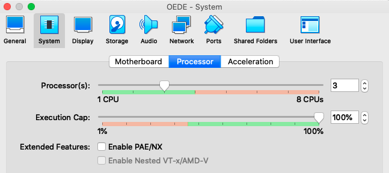

# Spark Workshop

## System Requirements

This workshop uses two approaches for running Spark:
* The command line interface `spark-shell`
* The embedded Spark in the Scala SBT application.

We provided a VM that has all dependencies pre-installed. 

Running the examples directly is also possible after 
[installing Spark](https://www.knowledgehut.com/blog/big-data/install-spark-on-ubuntu).

### Using the VM

Spark uses the available CPU cores for parallelization. Make sure that you have
more than 1 CPUs assigned to your VirtualBox image.



## Running Spark from the command line

Open a terminal window and start the spark console:

```bash
# Go to the source folder
cd code/spark-workshop/
# Start Spark Shell
spark-shell
```

Find the address of the Spark context Web UI in the output lines 
and open it in a browser (It should be something like http://10.0.2.15:4040).

## Examples

### Parallelization

```scala
// Create a regular list on the Driver
val list = (0 to 99).toList

// Distribute it to the workers
val rdd = sc.parallelize(list)

// Check Partition size
rdd.partitions.size

// Filter RDD
val evens = rdd.filter(n => n % 2 == 0)

// Check UI - nothing happened

// Collect
evens.collect

// Check UI again - DAG Visualization
```

## Word Count example

```scala
val wordCount = sc
    .textFile("nobel-laureates.csv")  // RDD of lines
    .flatMap(line => line.split(Array(' ', ',', '"')))
    .filter(word => word.nonEmpty)
    .map(word => (word, 1))
    .reduceByKey((a, b) => a + b) 

// Check UI - nothing happened

val frequentWords = wordCount
    .filter(pair => pair._2 > 60)
    .collect

// Check UI again. DAG visualization
// The whole chain is executed at once

val longWords = wordCount
    .filter(_._1.size > 15)
    .collect

// The whole chain is executed again
// Can be avoided by caching temporary results
wordCount.cache
```
